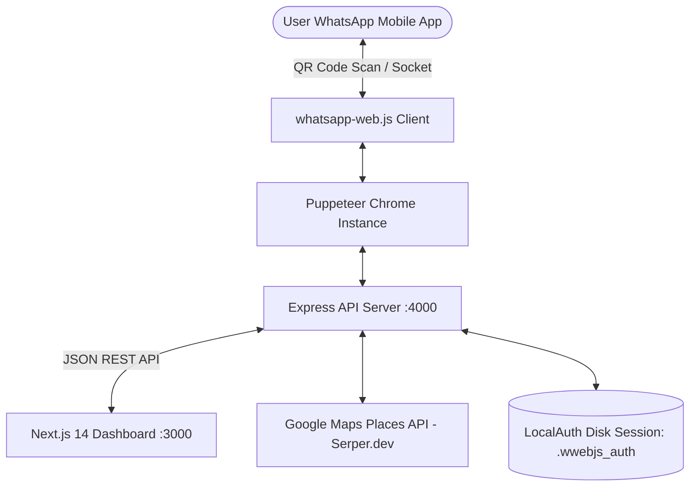

# 🚀 WhatsApp Automation & Local Lead Generation — Full Technical Architecture & Setup Guide

> **Purpose:** This document provides a complete technical blueprint, library inventory, system architecture, directory tree, and a step-by-step guide to building and running this application from scratch purely for local development.

---

## 📑 Table of Contents
1. [Tech Stack & Dependency Inventory](#1-tech-stack--dependency-inventory)
2. [System Architecture & Lifecycle Workflow](#2-system-architecture--lifecycle-workflow)
3. [Complete Directory Structure](#3-complete-directory-structure)
4. [Core Features & Engineering Logic](#4-core-features--engineering-logic)
5. [Step-by-Step Guide to Building From Scratch](#5-step-by-step-guide-to-building-from-scratch)
6. [Local Execution & Environment Setup](#6-local-execution--environment-setup)
7. [Troubleshooting & Best Practices](#7-troubleshooting--best-practices)

---

## 1. Tech Stack & Dependency Inventory

### 🔹 Frontend (Client Dashboard):
| Package / Technology | Version | Purpose |
| :--- | :--- | :--- |
| **Next.js (App Router)** | `^14.0.0` | React server-side rendering, routing, and modern frontend framework |
| **React & React DOM** | `^18.2.0` | Declarative UI component architecture and state management |
| **Javascript** | `^5.0.0` | Static typing, interface definitions, and compile-time validation |
| **Tailwind CSS** | `^3.3.0` | Modern Web3-inspired dark UI, glassmorphism, and responsive layout styling |
| **Framer Motion** | `^10.16.4` | Smooth interactive animations, micro-interactions, and collapsible transitions |
| **Lucide React** | `^0.292.0` | High-quality icon set for status badges, buttons, and navigation |
| **qrcode.react** | `^3.1.0` | Renders dynamic real-time SVG QR codes directly in the pairing modal |
| **Axios** | `^1.6.0` | HTTP client for interacting with the backend Express REST API |
| **PapaParse** | `^5.4.1` | In-browser CSV file parser for bulk contact importing |
| **Canvas Confetti** | `^1.9.0` | Visual celebration animation on campaign completion |
| **clsx & tailwind-merge** | `^2.x` | Utility for merging dynamic Tailwind utility classes |

### 🔹 Backend (Engine & Automation Core):
| Package / Technology | Version | Purpose |
| :--- | :--- | :--- |
| **Node.js** | `>= 18.x` | JavaScript runtime environment |
| **Express.js** | `^4.18.2` | RESTful API server routing and middleware pipeline |
| **whatsapp-web.js** | `github:pedroslopez/whatsapp-web.js` | Reverse-engineered WhatsApp Web protocol client with headless automation |
| **Puppeteer** | `^22.x / ^24.x` | Headless Chrome/Chromium automation browser controller |
| **LocalAuth (wwebjs)** | Built-in | Persists WhatsApp authenticated session tokens to local disk (`.wwebjs_auth/`) |
| **Serper API (Google Maps)** | REST API | Scrapes real verified business leads with phone numbers by category and city |
| **Multer** | `^1.4.5` | Multipart form-data parser for image and PDF file uploads |
| **Mime-Types** | `^2.1.35` | Automatic MIME type detection for dynamic media dispatch |
| **Dotenv & Cors** | Latest | Environment variable loading and Cross-Origin Resource Sharing control |
| **qrcode-terminal** | `^0.12.0` | Prints live ASCII QR codes in the backend terminal console |

---

## 2. System Architecture & Lifecycle Workflow



### Lifecycle Phases:
1. **Startup & Chrome Discovery**: The backend calls `chromeFinder.js` to locate an installed browser binary (e.g. `C:\Program Files\Google\Chrome\Application\chrome.exe` on Windows or `/usr/bin/google-chrome` on Linux).
2. **Session Authentication**: `LocalAuth` checks `.wwebjs_auth/` for a saved session. If absent, the `qr` event generates a pairing string displayed in terminal and frontend modal.
3. **Socket Ready State**: Once authenticated, chat models synchronize. When the `ready` event fires, the socket is fully armed for message transmission.
4. **Message Dispatch Pipeline**:
   - **Direct Single Dispatch**: Immediate transmission with parameter replacement (`{{name}}`, `{{phone}}`).
   - **Bulk Campaigns**: Batch queue with random human pacing (25–45s delays) to prevent account bans.
   - **Auto-Reply Service**: Responds to live inbound messages while maintaining a 24-hour per-contact cooldown.
   - **Lead Generation**: Queries Google Maps for businesses and formats phone numbers to WhatsApp international format (`91XXXXXXXXXX@c.us`).

---

## 3. Complete Directory Structure

```text
whatsapp-automation/
├── .env                          # Root environment variables
├── README.md                     # High-level overview
├── LOCAL_PROJECT_GUIDE.md        # Complete English architecture and setup guide
│
├── backend/                      # Node.js + Express API Backend
│   ├── .puppeteerrc.cjs          # Puppeteer cache configuration
│   ├── package.json              # Backend dependencies and scripts
│   ├── logs/
│   │   └── whatsapp.log          # Persistent server and automation logs
│   ├── uploads/                  # Temporary media file storage (images, PDFs)
│   ├── .wwebjs_auth/             # WhatsApp session credentials (LocalAuth)
│   └── src/
│       ├── index.js              # Server entry point with global error protection
│       ├── config/
│       │   └── autoReplyConfig.json # Auto-reply template, cooldown, and toggle state
│       ├── routes/
│       │   ├── autoReply.js      # Auto-reply CRUD & cooldown clearance endpoints
│       │   ├── leadFinder.js     # Google Maps lead search and CSV exporter
│       │   ├── sendBulk.js       # Bulk campaign queue and execution handler
│       │   ├── singleMessage.js  # Single direct message and verification endpoints
│       │   └── uploadMedia.js    # Multer media upload handler
│       ├── services/
│       │   ├── autoReplyService.js # Inbound message handler & cooldown manager
│       │   ├── campaignManager.js  # In-memory bulk campaign state tracker
│       │   └── whatsappService.js  # Core WhatsApp Web socket service
│       └── utils/
│           ├── chromeFinder.js   # Automatic system Chrome/Edge/Chromium locator
│           ├── delay.js          # Asynchronous sleep helper
│           ├── logger.js         # Timestamped file and console logger
│           └── phoneFormatter.js # Phone normalizer (adds country code + @c.us)
│
└── frontend/                     # Next.js 14 Web Application
    ├── package.json              # Frontend dependencies and build scripts
    ├── tailwind.config.js        # Web3 dark theme, glow effects, and color tokens
    ├── tsconfig.json             # TypeScript configuration
    └── src/
        ├── app/
        │   ├── layout.tsx        # Root HTML layout with Google Inter typography
        │   ├── globals.css       # Custom scrollbars, glassmorphism, and neon glow utility classes
        │   ├── page.tsx          # Root redirect to /dashboard
        │   └── dashboard/
        │       └── page.tsx      # Main dashboard with segmented Tri-Mode switcher
        ├── components/
        │   ├── AutoReplyManager.tsx       # Live auto-reply settings, logs, and cooldowns
        │   ├── CampaignControls.tsx       # Bulk blast progress bar, stats, and controls
        │   ├── ContactsTable.tsx          # Contact preview, editing, and CSV display
        │   ├── CSVUploader.tsx            # Drag-and-drop CSV importer
        │   ├── FloatingWhatsAppSimulator.tsx # Real-time floating mobile phone preview
        │   ├── LeadFinderModal.tsx        # Google Maps lead extraction modal
        │   ├── MediaUploader.tsx          # Image & document attachment interface
        │   ├── MessageEditor.tsx          # Template composer with tag replacement
        │   ├── SingleMessageSender.tsx    # Single direct message dispatcher
        │   ├── WhatsAppPreview.tsx        # Message rendering card
        │   ├── WhatsAppStatusModal.tsx    # QR scanner, session reset, and status modal
        │   └── ui/                        # Reusable buttons, inputs, dialogs, badges
        ├── config/
        │   └── categoryTemplates.ts       # 15+ pre-written marketing templates
        ├── lib/
        │   └── api.ts                     # Axios API client functions with extended timeouts
        └── types/
```

---

## 4. Core Features & Engineering Logic

### 1. Direct Single Dispatch
- Sends WhatsApp messages instantly to any number without saving the contact in your phone address book.
- Automatically handles variable replacement: `{{name}}` with recipient name and `{{phone}}` with phone number.
- Fast optimistic verification fallback prevents UI locks.

### 2. Bulk Blast Campaign Engine with Anti-Ban Shield
- Accepts parsed CSV files or leads imported directly from the Google Maps Lead Finder.
- **Anti-Ban Protection**: Dispatches messages sequentially with randomized delays of **25 to 45 seconds** between recipients.
- Real-time campaign tracking via polling `GET /api/campaigns/:id`.

### 3. Local Lead Finder (Google Maps Integration)
- Connects to Serper.dev Places API (`POST https://google.serper.dev/maps`).
- Queries target categories (e.g. `Bakery`, `Gym`, `Real Estate`, `Dentist`) across specified locations.
- Extracts verified phone numbers, business names, addresses, ratings, and reviews.
- Allows 1-click import into the Bulk Blast contacts queue with matching category outreach templates.

### 4. Smart Auto-Reply Engine
- Intercepts incoming messages and automatically replies with a customizable portfolio or introductory template.
- **24-Hour Cooldown Filter**: Prevents repetitive loops by ensuring each unique contact receives only one automated response within the specified cooldown window.
- **Historical Chat Filter**: Disregards historical unread messages synced upon initial login, responding only to live inbound traffic.
- **Default Disabled**: Initial state is set to `enabled: false` to avoid unintended outbound dispatches on startup.

---

## 5. Step-by-Step Guide to Building From Scratch

### Step 1: Initialize Root Directory & Environment
Create a root folder and a `.env` file:
```bash
mkdir whatsapp-automation
cd whatsapp-automation
```

Create `.env` in the root:
```env
PORT=4000
DEFAULT_COUNTRY_CODE=91
WHATSAPP_HEADLESS=true
SERPER_API_KEY=your_serper_dev_api_key_here
```
*(Get a free API key at [https://serper.dev](https://serper.dev))*

---

### Step 2: Initialize & Configure Backend
```bash
mkdir backend
cd backend
npm init -y
```

Install backend dependencies:
```bash
npm install express cors dotenv axios multer mime-types uuid qrcode-terminal puppeteer whatsapp-web.js@github:pedroslopez/whatsapp-web.js
npm install --save-dev nodemon
```

Configure scripts in `backend/package.json`:
```json
"scripts": {
  "start": "node src/index.js",
  "dev": "nodemon src/index.js"
}
```

---

### Step 3: Initialize & Configure Frontend (Next.js 14)
From the root directory:
```bash
npx create-next-app@14 frontend --typescript --tailwind --eslint --app --src-dir --import-alias "@/*" --use-npm
cd frontend
```

Install frontend dependencies:
```bash
npm install axios framer-motion lucide-react qrcode.react papaparse canvas-confetti clsx tailwind-merge
npm install --save-dev @types/papaparse @types/canvas-confetti
```

---

## 6. Local Execution & Environment Setup

Run the backend and frontend simultaneously in separate terminals:

### Terminal 1 — Backend:
```bash
cd backend
npm run dev
```
*Console output when ready:*
```text
[INFO] Found system browser binary: C:\Program Files\Google\Chrome\Application\chrome.exe
[INFO] Initializing WhatsApp client (Headless: true)
[INFO] Backend listening on http://localhost:4000
```

### Terminal 2 — Frontend:
```bash
cd frontend
npm run dev
```
*Open dashboard in browser:* **[http://localhost:3000](http://localhost:3000)**

---

## 7. Troubleshooting & Best Practices

1. **Chrome Binary Resolution**:
   - `whatsappService.js` uses `chromeFinder.js` to automatically verify local paths like `C:\Program Files\Google\Chrome\Application\chrome.exe` on Windows and `/usr/bin/google-chrome` on Linux.
2. **Session Reset & Unlinking**:
   - If a session becomes corrupted or desynchronized, click **Reset Session** in the dashboard modal or delete the `backend/.wwebjs_auth` folder and restart the server.
3. **Process Protection**:
   - `index.js` includes global `uncaughtException` and `unhandledRejection` handlers to prevent server termination during network interruptions or browser reloads.
4. **Anti-Ban Safety Guidelines**:
   - Limit outbound cold outreach to 40–50 messages per day per WhatsApp number.
   - Maintain the default 25–45s interval delay between recipients during bulk campaigns.
   - Use variable personalization (`{{name}}`) so every outbound message is unique.

---
*Created for Suraj Banerjee — WhatsApp Automation Suite.*
