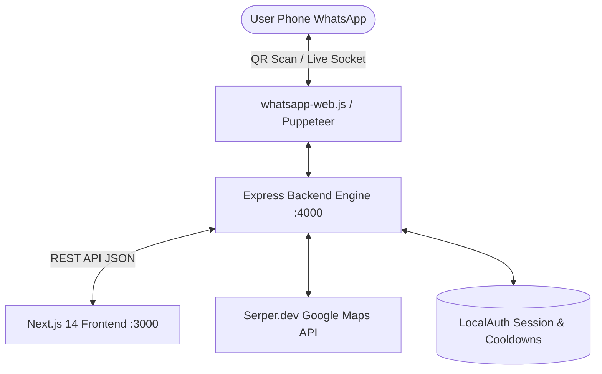

# 🚀 WhatsApp Automation & Lead Generation — Full Project Architecture & Local Setup Guide

> **উদ্দেশ্য:** এই ডকুমেন্টে প্রজেক্টটিতে ব্যবহৃত সমস্ত টেকনোলজি, লাইব্রেরি, আর্কিটেকচার, ফাইল স্ট্রাকচার এবং স্ক্র্যাচ থেকে সম্পূর্ণ নতুন লোকাল প্রজেক্ট সেটআপ করার জন্য পুঙ্খানুপুঙ্খ গাইড বিস্তারিত দেওয়া হলো।

---

## 📑 সূচিপত্র (Table of Contents)
1. [ব্যবহৃত প্রযুক্তি ও লাইব্রেরিসমূহ (Tech Stack & Libraries)](#1-ব্যবহৃত-প্রযুক্তি-ও-লাইব্রেরিসমূহ-tech-stack--libraries)
2. [সিস্টেম আর্কিটেকচার ও ওয়ার্কফ্লো (System Architecture & Workflow)](#2-সিস্টেম-আর্কিটেকচার-ও-ওয়ার্কফ্লো-system-architecture--workflow)
3. [প্রজেক্ট ফোল্ডার স্ট্রাকচার (Directory Structure)](#3-প্রজেক্ট-ফোল্ডার-স্ট্রাকচার-directory-structure)
4. [ফিচারসমূহ ও তাদের কাজের ধরন (Key Features Breakdown)](#4-ফিচারসমূহ-ও-তাদের-কাজের-ধরন-key-features-breakdown)
5. [স্ক্র্যাচ থেকে নতুন প্রজেক্ট তৈরির স্টেপ-বাই-স্টেপ গাইড (Step-by-Step Local Setup)](#5-স্ক্র্যাচ-থেকে-নতুন-প্রজেক্ট-তৈরির-স্টেপ-বাই-স্টেপ-গাইড-step-by-step-local-setup)
6. [জরুরি কনফিগারেশন ও বেস্ট প্র্যাকটিস (Critical Configurations & Tips)](#6-জরুরি-কনফিগারেশন-ও-বেস্ট-প্র্যাকটিস-critical-configurations--tips)

---

## 1. ব্যবহৃত প্রযুক্তি ও লাইব্রেরিসমূহ (Tech Stack & Libraries)

### 🔹 ফ্রন্টএন্ড (Frontend Stack):
| টেকনোলজি / লাইব্রেরি | সংস্করণ | ব্যবহারের উদ্দেশ্য |
| :--- | :--- | :--- |
| **Next.js (App Router)** | `^14.0.0` | React-ভিত্তিক ফ্রন্টএন্ড ফ্রেমওয়ার্ক ও ড্যাশবোর্ড রেন্ডারিং |
| **React & React DOM** | `^18.2.0` | UI কম্পোনেন্ট ম্যানেজমেন্ট ও স্টেট হ্যান্ডলিং |
| **TypeScript** | `^5.0.0` | টাইপ-সেফ কোডিং ও এরর প্রতিরোধ |
| **Tailwind CSS** | `^3.3.0` | ডার্ক Web3 নিয়ন ও গ্লাস-মরফিজম (Glassmorphism) স্টাইলিং |
| **Framer Motion** | `^10.16.4` | স্মুথ ইন্টারঅ্যাক্টিভ অ্যানিমেশন ও ট্রানজিশন |
| **Lucide React** | `^0.292.0` | মডার্ন আইকন সেট (Icons) |
| **qrcode.react** | `^3.1.0` | ব্রাউজার ড্যাশবোর্ডে রিয়েল-টাইম WhatsApp QR কোড SVG রেন্ডার করা |
| **Axios** | `^1.6.0` | ব্যাকএন্ড REST API-এর সাথে কমিউনিকেশন |
| **PapaParse** | `^5.4.1` | CSV ফাইল পার্স করে ফোন নম্বর ও নাম এক্সট্র্যাক্ট করা |
| **Canvas Confetti** | `^1.9.0` | ক্যাম্পেইন সফল হলে কনফেটি অ্যানিমেশন দেখানো |

### 🔹 ব্যাকএন্ড (Backend Stack):
| টেকনোলজি / লাইব্রেরি | সংস্করণ | ব্যবহারের উদ্দেশ্য |
| :--- | :--- | :--- |
| **Node.js** | `>= 18.x` | সার্ভার রানটাইম এনভায়রনমেন্ট |
| **Express.js** | `^4.18.2` | REST API সার্ভার তৈরি ও রাউটিং |
| **whatsapp-web.js** | `github:pedroslopez/whatsapp-web.js` | WhatsApp Web সকেট প্রোটোকল হ্যান্ডলিং ও অটোমেশন |
| **Puppeteer** | `^22.x / ^24.x` | হেডলেস ক্রোমিয়াম ব্রাউজার কন্ট্রোল ও সেশন মেইনটেইন |
| **LocalAuth (wwebjs)** | Built-in | সেশন ডেটা লোকাল ডিস্কে সেভ রাখা (যাতে প্রতিবার QR স্ক্যান না করতে হয়) |
| **Serper API (Google Maps)** | REST API | গুগল ম্যাপস থেকে লোকাল শপ/বিজনেসের ভেরিফায়েড ফোন নম্বর ও লিড সংগ্রহ |
| **Multer** | `^1.4.5` | ইমেজ/পিডিএফ ফাইল আপলোড হ্যান্ডলিং |
| **Mime-Types** | `^2.1.35` | ফাইল টাইপ ও এক্সটেনশন স্বয়ংক্রিয়ভাবে ডিটেক্ট করা |
| **Dotenv & Cors** | Latest | এনভায়রনমেন্ট ভেরিয়েবল ও ক্রস-অরিজিন পলিসি কনফিগারেশন |
| **qrcode-terminal** | `^0.12.0` | ব্যাকএন্ড কনসোল/টার্মিনালেও QR কোড প্রিন্ট করা |

---

## 2. সিস্টেম আর্কিটেকচার ও ওয়ার্কফ্লো (System Architecture & Workflow)



1. **ইনিশিয়ালাইজেশন**: ব্যাকএন্ড চালু হলে `chromeFinder.js` আপনার পিসির ইনস্টল করা Google Chrome (`chrome.exe`) বা Puppeteer ক্রোমিয়াম ডিটেক্ট করে Puppeteer লঞ্চ করে।
2. **লগইন হ্যান্ডশেক (QR Sync)**: ব্রাউজারে WhatsApp Web লোড হলে একটি ইউনিক QR কোড পাওয়া যায়, যা ফ্রন্টএন্ডের `/api/status` এন্ডপয়েন্টে পাঠানো হয়। ইউজার ফোনে স্ক্যান করার পর সেশনটি `.wwebjs_auth/` ফোল্ডারে সেভ থাকে।
3. **মেসেজ ডিসপ্যাচ**:
   - **Direct Single**: সাথে সাথে রিয়েল-টাইমে পাঠানো হয়।
   - **Bulk Blast**: ব্যান এড়ানোর জন্য ২৫-৪৫ সেকেন্ড র‍্যান্ডম হিউম্যান-লাইক ডিলে দিয়ে প্রতিটি নাম পারসোনালাইজ করে পাঠানো হয়।
   - **Auto-Reply**: কোনো ইউজার ইনবাউন্ড মেসেজ পাঠালে ২৪ ঘণ্টার কুলডাউন বজায় রেখে স্বয়ংক্রিয় থ্যাঙ্ক ইউ মেসেজ যায়।
   - **Lead Finder**: নিশ (যেমন: Cake Shop) ও লোকেশন (যেমন: Garia, Kolkata) দিয়ে সার্চ দিলে গুগল ম্যাপস থেকে ফোন নম্বর স্ক্র্যাপ করে সরাসরি বাল্ক লিস্টে ইমপোর্ট করে।

---

## 3. প্রজেক্ট ফোল্ডার স্ট্রাকচার (Directory Structure)

```text
whatsapp-automation/
├── .env                          # গ্লোবাল এনভায়রনমেন্ট ভেরিয়েবল
├── README.md                     # প্রজেক্ট ওভারভিউ
├── LOCAL_PROJECT_GUIDE.md        # সম্পূর্ণ লোকাল সেটআপ গাইড
│
├── backend/                      # নোডজেএস এক্সপ্রেস ব্যাকএন্ড
│   ├── .puppeteerrc.cjs          # পাপেটিয়ার কনফিগ
│   ├── package.json              # ব্যাকএন্ড ডিপেনডেন্সিসমূহ
│   ├── logs/
│   │   └── whatsapp.log          # রিয়েল-টাইম লগিং ফাইল
│   ├── uploads/                  # মিডিয়া আপলোড স্টোরেজ (ইমেজ/পিডিএফ)
│   ├── .wwebjs_auth/             # লোকাল হোয়াটসঅ্যাপ লগইন সেশন (LocalAuth)
│   └── src/
│       ├── index.js              # এক্সপ্রেস সার্ভার এন্ট্রি পয়েন্ট
│       ├── config/
│       │   └── autoReplyConfig.json # অটো-রিপ্লাই টেমপ্লেট ও কুলডাউন কনফিগ
│       ├── routes/
│       │   ├── autoReply.js      # অটো-রিপ্লাই রাউটস
│       │   ├── leadFinder.js     # গুগল ম্যাপস লিড স্ক্র্যাপার রাউটস
│       │   ├── sendBulk.js       # বাল্ক ক্যাম্পেইন প্রসেসিং রাউটস
│       │   ├── singleMessage.js  # ডাইরেক্ট সিঙ্গেল মেসেজ রাউটস
│       │   └── uploadMedia.js    # ফাইল আপলোড রাউটস
│       ├── services/
│       │   ├── autoReplyService.js # অটো-রিপ্লাই লজিক ও কুলডাউন হ্যান্ডলার
│       │   ├── campaignManager.js  # বাল্ক ক্যাম্পেইন স্ট্যাটাস ট্র্যাকার
│       │   └── whatsappService.js  # মেইন হোয়াটসঅ্যাপ সকেট সার্ভিস
│       └── utils/
│           ├── chromeFinder.js   # সিস্টেম ক্রোম ডিটেকশন ইউটিলিটি
│           ├── delay.js          # র‍্যান্ডম ডিলে প্রমিজ
│           ├── logger.js         # কনসোল ও ফাইল লগার
│           └── phoneFormatter.js # ফোন নম্বর ফরম্যাটার (৯১ প্রিফিক্স ও @c.us)
│
└── frontend/                     # নেক্সট জেএস ফ্রন্টএন্ড ড্যাশবোর্ড
    ├── package.json              # ফ্রন্টএন্ড ডিপেনডেন্সিসমূহ
    ├── tailwind.config.js        # কাস্টম কালার ও অ্যানিমেশন থিম
    ├── tsconfig.json
    └── src/
        ├── app/
        │   ├── layout.tsx        # রুট লেআউট ও ফন্ট
        │   ├── globals.css       # গ্লোবাল গ্লাস-মরফিজম ও ডার্ক থিম সিএসএস
        │   ├── page.tsx          # রিডাইরেক্ট টু /dashboard
        │   └── dashboard/
        │       └── page.tsx      # মেইন ড্যাশবোর্ড (সিঙ্গেল, বাল্ক ও অটো-রিপ্লাই)
        ├── components/
        │   ├── AutoReplyManager.tsx       # অটো-রিপ্লাই কনফিগ প্যানেল
        │   ├── CampaignControls.tsx       # বাল্ক ক্যাম্পেইন স্টার্ট ও প্রগ্রেস
        │   ├── ContactsTable.tsx          # ইমপোর্টেড লিড টেবিল
        │   ├── CSVUploader.tsx            # ড্র্যাগ অ্যান্ড ড্রপ CSV আপলোডার
        │   ├── FloatingWhatsAppSimulator.tsx # লাইভ হোয়াটসঅ্যাপ প্রিভিউ চ্যাট
        │   ├── LeadFinderModal.tsx        # গুগল ম্যাপস লিড ফাইন্ডার মোডাল
        │   ├── MediaUploader.tsx          # মিডিয়া অ্যাটাচমেন্ট বক্স
        │   ├── MessageEditor.tsx          # মেসেজ কম্পোজার ও নিশ টেমপ্লেট
        │   ├── SingleMessageSender.tsx    # ডাইরেক্ট সিঙ্গেল মেসেজ ডিসপ্যাচার
        │   ├── WhatsAppPreview.tsx        # প্রিভিউ কার্ড
        │   ├── WhatsAppStatusModal.tsx    # কিউআর স্ক্যানার ও সেশন কন্ট্রোলার
        │   └── ui/                        # বাটন, ইনপুট, কার্ড, ডায়লগ কম্পোনেন্টস
        ├── config/
        │   └── categoryTemplates.ts       # ১৫+ ক্যাটাগরির রেডিমেড মার্কেটিং টেমপ্লেট
        ├── lib/
        │   └── api.ts                     # ব্যাকএন্ড API হেল্পার ফাংশনসমূহ
        └── types/
```

---

## 4. ফিচারসমূহ ও তাদের কাজের ধরন (Key Features Breakdown)

### ১. ডাইরেক্ট সিঙ্গেল মেসেজিং (Direct Single Message):
- কোনো কন্টাক্ট সেভ না করেই সরাসরি যেকোনো ভারতীয় বা আন্তর্জাতিক নম্বরে মেসেজ পাঠানোর সুবিধা।
- মেসেজে `{{name}}` এবং `{{phone}}` ভেরিয়েবল ডায়নামিক্যালি প্রতিস্থাপন হয়।

### ২. বাল্ক ক্যাম্পেইন ব্লাস্ট ও অ্যান্টি-ব্যান গার্ড (Bulk Blast & Anti-Ban):
- একসাথে ২০টি কন্টাক্টে শিডিউল করে ক্যাম্পেইন চালানো যায়।
- WhatsApp যেন স্প্যাম হিসেবে অ্যাকাউন্ট ব্যান না করে, সেজন্য প্রতিটি মেসেজের মাঝে **২৫ থেকে ৪৫ সেকেন্ড র‍্যান্ডম ডিলে** দেওয়া হয়।

### ৩. লোকাল লিড ফাইন্ডার (Google Maps Lead Finder):
- `Serper.dev` API-এর মাধ্যমে যেকোনো ক্যাটাগরি (যেমন: *Bakery, Gym, Salon, Real Estate*) ও লোকেশন দিয়ে সার্চ করলে রিয়েল বিজনেসের ফোন নম্বর বের করে আনে।
- এক ক্লিকে সেই নম্বরগুলোকে সরাসরি বাল্ক ক্যাম্পেইনে ইমপোর্ট করা যায়।

### ৪. অটোনোমাস অটো-রিপ্লাই ইঞ্জিন (Smart Auto-Reply):
- ইনবাউন্ড কাস্টমার মেসেজ আসলে স্বয়ংক্রিয়ভাবে পোর্টফোলিও বা থ্যাঙ্ক ইউ মেসেজ রিপ্লাই করে।
- **২৪ ঘণ্টার লুপ প্রোটেকশন (Cooldown)** যাতে একই কাস্টমারকে বারবার রিপ্লাই দিয়ে বিরক্ত না করে।

---

## 5. স্ক্র্যাচ থেকে নতুন প্রজেক্ট তৈরির স্টেপ-বাই-স্টেপ গাইড (Step-by-Step Local Setup)

### স্টেপ ১: ফোল্ডার তৈরি ও রুট এনভায়রনমেন্ট
একটি নতুন ফোল্ডার তৈরি করে রুট ডিরেক্টরিতে `.env` ফাইল তৈরি করুন:
```env
PORT=4000
DEFAULT_COUNTRY_CODE=91
WHATSAPP_HEADLESS=true
SERPER_API_KEY=your_serper_api_key_here
```
*(Serper API কী ফ্রিতে [https://serper.dev](https://serper.dev)-এ সাইন আপ করে নিতে পারবেন)*

---

### স্টেপ ২: ব্যাকএন্ড প্রজেক্ট ইনিশিয়ালাইজ ও প্যাকেজ ইনস্টলেশন
```bash
mkdir backend
cd backend
npm init -y
```

`backend/package.json`-এ প্রয়োজনীয় ডিপেনডেন্সি ইনস্টল করুন:
```bash
npm install express cors dotenv axios multer mime-types uuid qrcode-terminal puppeteer whatsapp-web.js@github:pedroslopez/whatsapp-web.js
npm install --save-dev nodemon
```

`package.json`-এর `scripts` সেকশনে যোগ করুন:
```json
"scripts": {
  "start": "node src/index.js",
  "dev": "nodemon src/index.js"
}
```

---

### স্টেপ ৩: ফ্রন্টএন্ড প্রজেক্ট তৈরি (Next.js 14)
রুট ডিরেক্টরি থেকে ফ্রন্টএন্ড তৈরি করুন:
```bash
npx create-next-app@14 frontend --typescript --tailwind --eslint --app --src-dir --import-alias "@/*" --use-npm
cd frontend
```

ফ্রন্টএন্ডের জন্য প্রয়োজনীয় লাইব্রেরিসমূহ ইনস্টল করুন:
```bash
npm install axios framer-motion lucide-react qrcode.react papaparse canvas-confetti clsx tailwind-merge
npm install --save-dev @types/papaparse @types/canvas-confetti
```

---

### স্টেপ ৪: লোকাল প্রজেক্ট রান করার নিয়ম
সর্বদা দুটি টার্মিনাল ওপেন রাখুন:

**টার্মিনাল ১ (Backend):**
```bash
cd backend
npm run dev
```
*(সফলভাবে রান হলে কনসোলে আসবে: `Backend listening on http://localhost:4000`)*

**টার্মিনাল ২ (Frontend):**
```bash
cd frontend
npm run dev
```
*(ব্রাউজারে ওপেন করুন: [http://localhost:3000](http://localhost:3000))*

---

## 6. জরুরি কনফিগারেশন ও বেস্ট প্র্যাকটিস (Critical Configurations & Tips)

1. **লোকাল ক্রোম পাথ ডিটেকশন**:
   - উইন্ডোজে Puppeteer অনেক সময় ক্রোম খুঁজে পায় না। সেজন্য `chromeFinder.js`-এর মতো হেল্পার ব্যবহার করে `C:\Program Files\Google\Chrome\Application\chrome.exe` পাথ নিশ্চিত করা হয়েছে।
2. **অটো-রিপ্লাই ডিফল্ট অফ রাখা**:
   - `autoReplyConfig.json`-এ সর্বদা `"enabled": false` রাখা উচিত, যাতে সার্ভার চালুর সাথে সাথে পুরনো বন্ধুদের কাছে মেসেজ না যায়।
3. **সেশন ব্যাকআপ ও রিসেট**:
   - সেশন নষ্ট হলে বা লগআউট করতে চাইলে `backend/.wwebjs_auth` ফোল্ডারটি ডিলিট করে সার্ভার রিস্টার্ট করলেই নতুন ফ্রেশ QR কোড চলে আসবে।
4. **অ্যান্টি-ব্যান টিপস**:
   - প্রতিদিন নতুন নম্বরে ৫০টির বেশি মেসেজ পাঠানো এড়িয়ে চলুন।
   - প্রতি ব্যাচে সর্বোচ্চ ১৫-২০টি মেসেজ পাঠান এবং মেসেজের ডিলে ২৫-৪৫ সেকেন্ড রাখুন।

---
*Created for Suraj Banerjee — WhatsApp Outreach & Automation Suite.*
